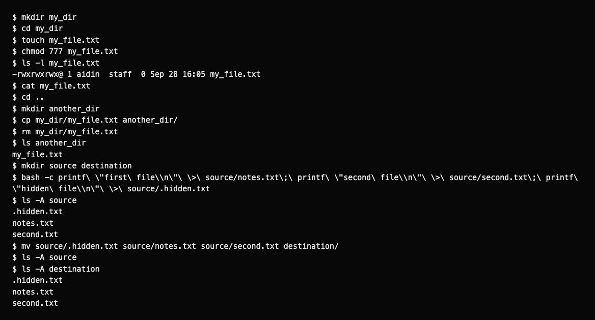
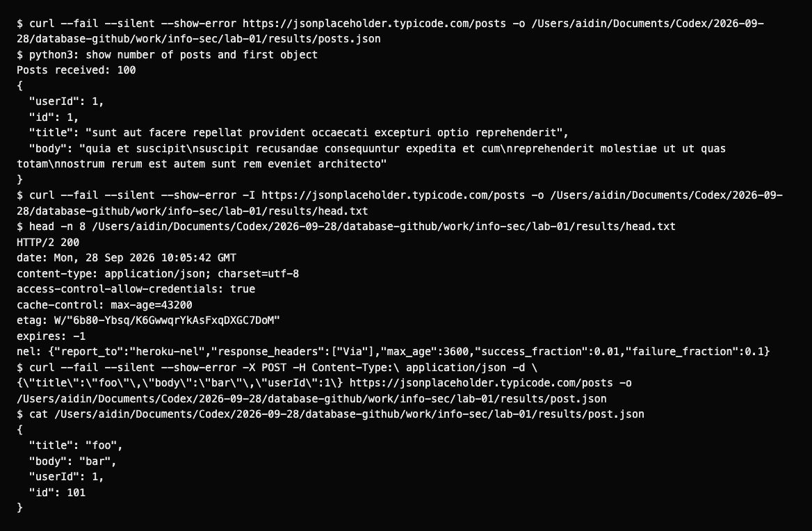
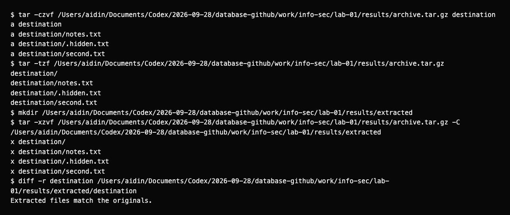

# Lab 1: UNIX commands

I created two folders and moved the files between them with `mv`, including a hidden file. I used `curl` for GET, HEAD and POST requests and saved the GET response as JSON. I also created a `tar.gz` archive and checked the extracted files against the originals. `cp` leaves the original file in place; `mv` moves it.

## Run

From the repository root:

```bash
bash lab-01/commands.sh /tmp/info-sec-lab1-results
```

Use a new output directory for each run. The script keeps all file operations in a temporary working folder.

## Results

| Check | Result |
|---|---|
| Move files | Three files moved; the source folder was empty. |
| GET | 100 posts saved in [posts.json](results/posts.json). |
| HEAD | HTTP 200; [response headers](results/head.txt). |
| POST | The response contains the submitted fields and `id: 101`; [response](results/post.json). |
| Extract archive | `diff -r` found no differences. |

JSONPlaceholder simulates POST requests; it does not save the new post on the server. See the [API guide](https://jsonplaceholder.typicode.com/guide/).

Full command logs: [files](results/files.txt), [HTTP](results/http.txt), [tar](results/archive.txt). `chmod 777` follows the exercise on an empty disposable file: it grants read, write and execute permissions to everyone.

## Screenshots

These are browser screenshots of reports displaying the recorded command output.







[Assignment](https://docs.google.com/document/d/1mglrCwzt-hevxKgBr-5jgQ3S4Fml2BQB/edit).
