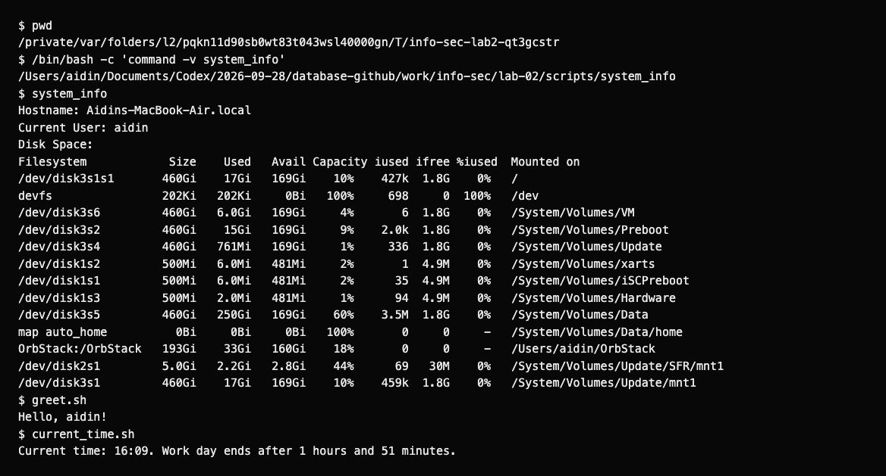
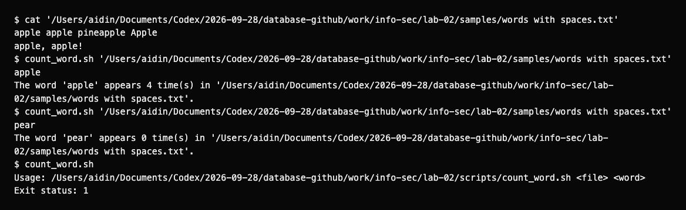
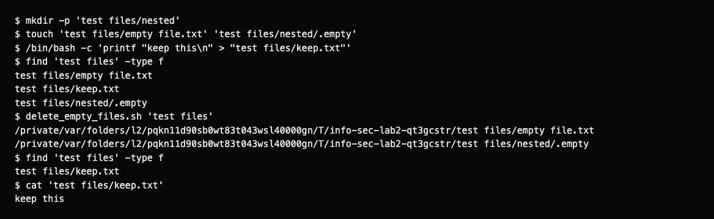

# Lab 2: custom commands

I wrote `system_info` and four Bash scripts. The time script counts down to 18:00, and the word counter counts whole words with matching case. The cleanup script prints the names of the empty files it deletes. I checked the scripts with sample files and invalid arguments.

## Run

From the repository root:

```bash
export PATH="$PWD/lab-02/scripts:$PATH"
system_info
greet.sh
current_time.sh
count_word.sh "lab-02/samples/words with spaces.txt" apple
```

This PATH change applies to the current session. The files already have executable permissions. `system_info` can also be called after changing to another directory.

For the cleanup exercise, use disposable files:

```bash
sample_dir=$(mktemp -d)
mkdir "$sample_dir/nested"
touch "$sample_dir/empty.txt" "$sample_dir/nested/.empty"
printf 'keep this\n' > "$sample_dir/keep.txt"
delete_empty_files.sh "$sample_dir"
find "$sample_dir" -type f
```

## Results

| Script | Check |
|---|---|
| `system_info` | Reports hostname, username and `df -h`; ran from another directory. |
| `greet.sh` | Printed `Hello, aidin!`, matching `whoami`. |
| `current_time.sh` | 13:30 gives 4 hours and 30 minutes; 18:00 and later report that the day ended. |
| `count_word.sh` | `apple` occurs 4 times in the sample; `Apple` and `pineapple` do not count. `pear` gives 0. |
| `delete_empty_files.sh` | Removed two empty files, including a nested hidden file; kept the file containing text. |

The saved command log uses the actual system clock. The word counter uses literal, case-sensitive matches and grep word boundaries in the C locale. Cleanup searches nested folders and does not follow symbolic links.

Full logs: [commands](results/commands.txt), [words](results/words.txt), [cleanup](results/cleanup.txt).

## Screenshots

These reports display the recorded output of the scripts.







[Assignment](https://docs.google.com/document/d/10NiPchRJCOz84ndxy1rQ3dR7A5FAjIS1-Evz1qzJURA/edit).
