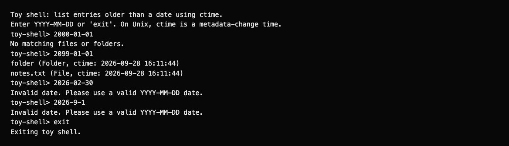
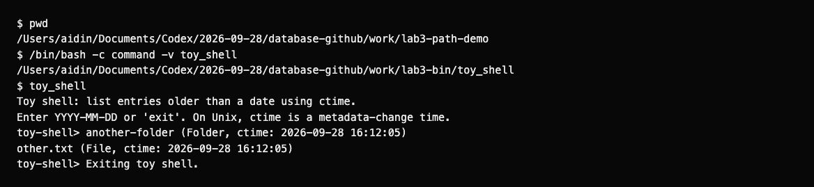

# Lab 3: toy shell

I used the Python example from the assignment. The shell accepts `YYYY-MM-DD` and lists files and folders with earlier `ctime` values in the current directory. I checked invalid dates, `exit` and a launch from another folder through PATH. On Unix, `ctime` records metadata changes, not file creation.

## Run

From the repository root:

```bash
python3 lab-03/toy_shell.py
```

To call it as `toy_shell` from another directory without a system installation:

```bash
shell_file="$PWD/lab-03/toy_shell.py"
bin_dir=$(mktemp -d)
ln -s "$shell_file" "$bin_dir/toy_shell"
export PATH="$bin_dir:$PATH"
cd /tmp
toy_shell
```

## Results

| Input | Result |
|---|---|
| `2000-01-01` | No matches among the new sample files. |
| `2099-01-01` | The sample file and folder are listed. |
| `2026-02-30` | Invalid calendar date. |
| `2026-9-1` | Rejected because the format requires two-digit months and days. |
| `exit` | Ends the session. |
| Ctrl+C | Keeps the shell running and shows how to exit. |
| EOF / Ctrl+D | Ends the session without a traceback. |

The cutoff is midnight in the local timezone. Names are sorted before display. The input loop and date filter are adapted from the [course example](https://docs.google.com/document/d/1Ubfi15uduKb4DjIYszmGdIclY_7THNAHx6gQnqCo5iI/edit); format validation, EOF handling and the timestamp label were adjusted.

The timestamp label follows [Python's `getctime` documentation](https://docs.python.org/3/library/os.path.html#os.path.getctime). Changing permissions can change this time on Unix.

Full logs: [interactive session](results/session.txt), [PATH demonstration](results/path.txt). The PATH demonstration supplied `2099-01-01` and `exit` through standard input.

## Screenshots

These reports display the recorded command output.




